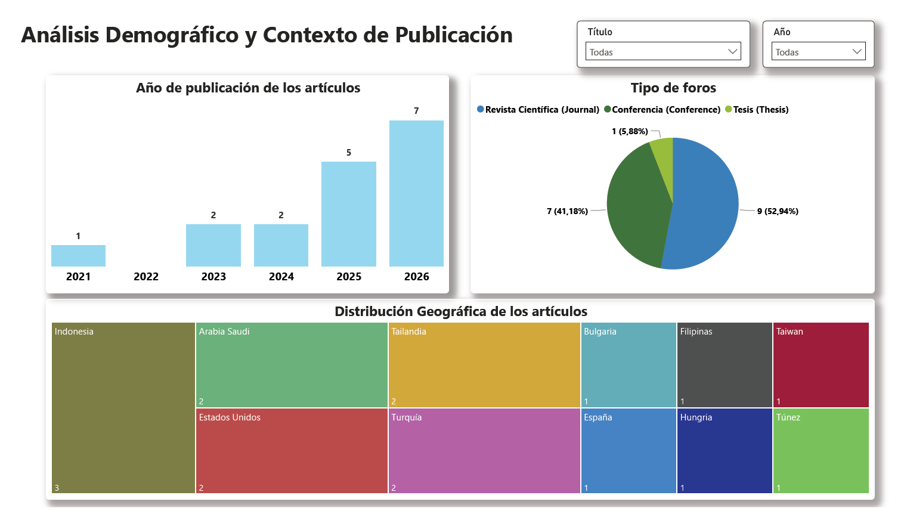
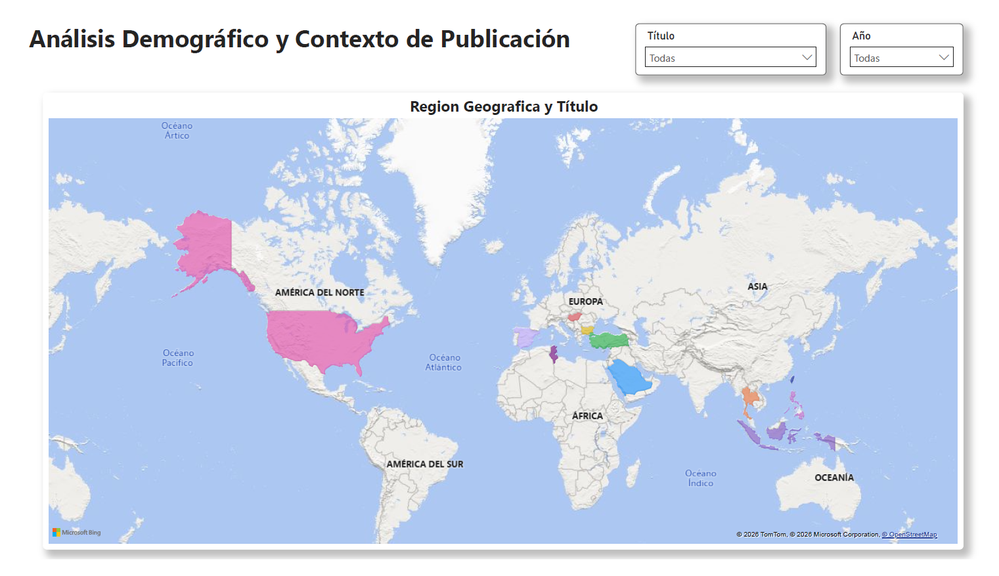
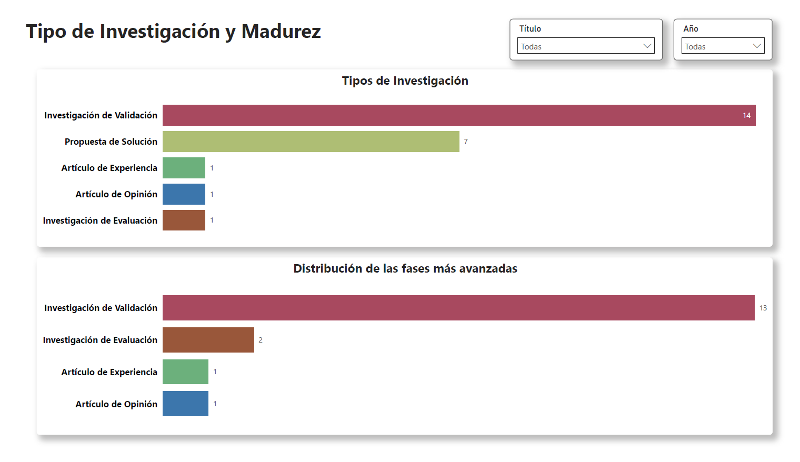
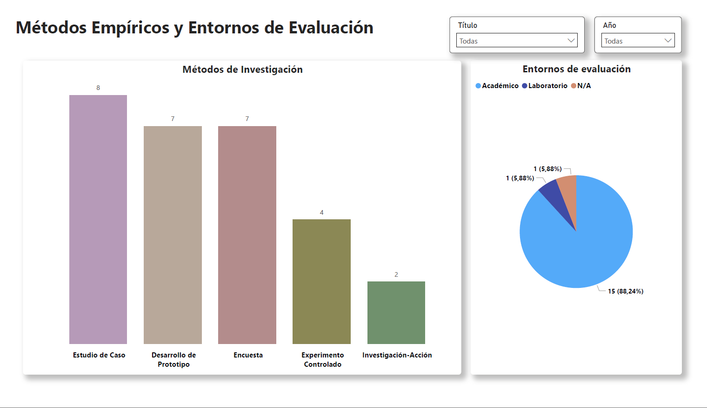
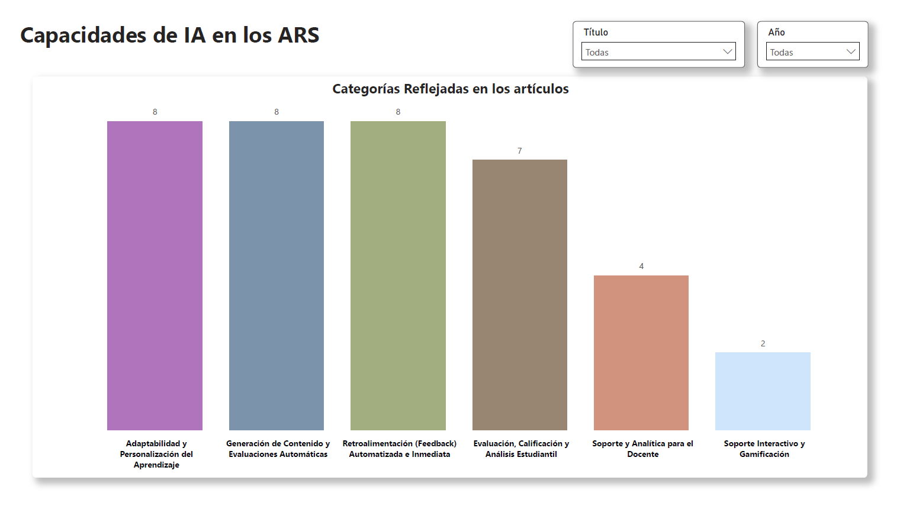
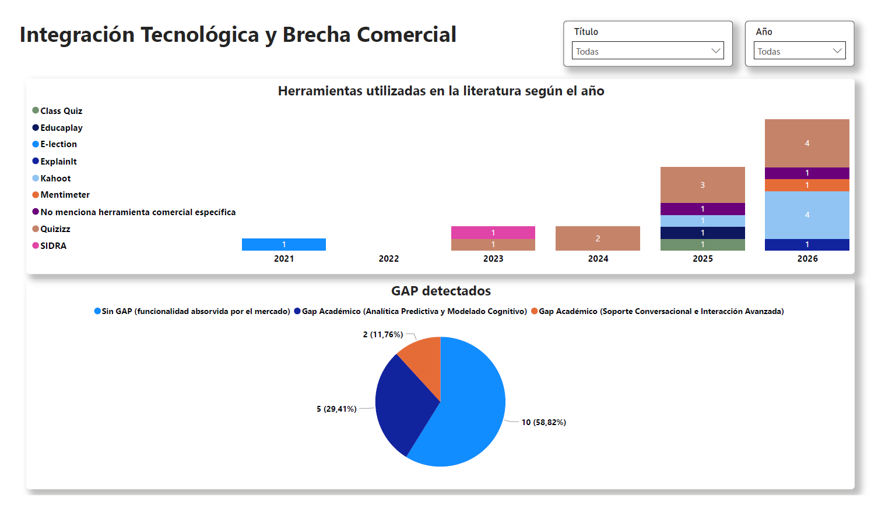
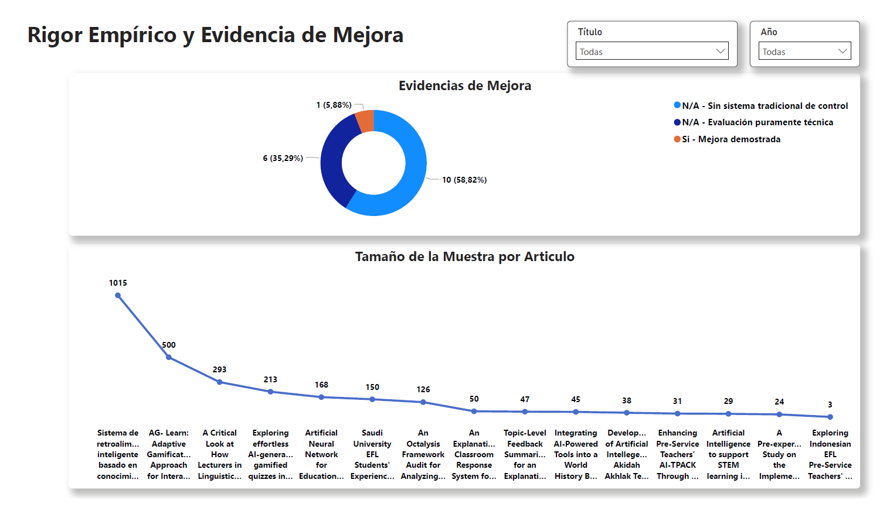
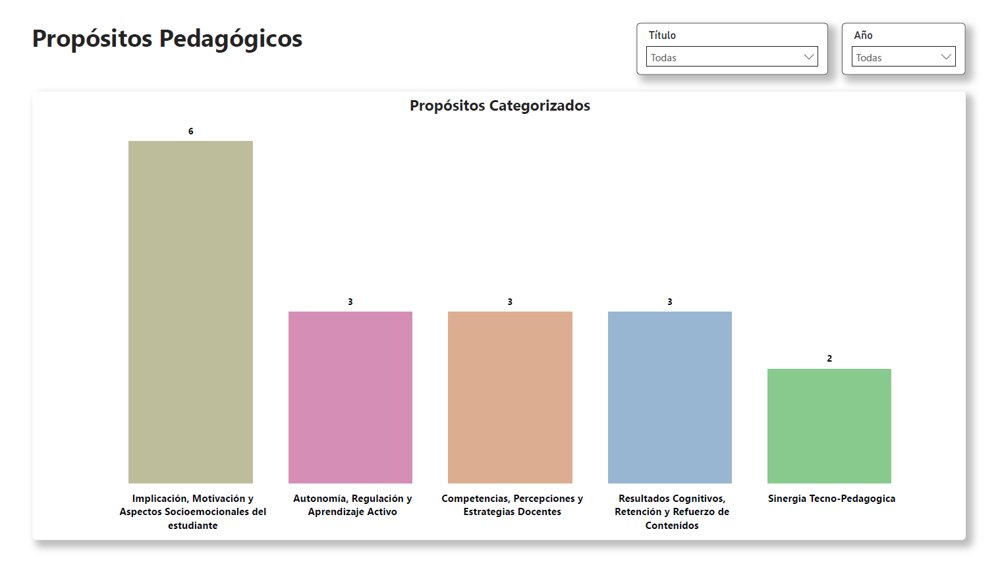

# Mapeo Sistemático sobre la Inteligencia Artificial en Sistemas de Respuesta de Audiencia: Propuesta de un Modelo de Tutorización Inteligente
IA en la dinámica de audiencia: comparativa de plataformas interactivas para educación

##  Resumen (Abstract)
Este repositorio contiene el conjunto de datos empíricos, la documentación y las herramientas analíticas desarrolladas como parte del Trabajo de Fin de Grado (TFG) *"IA en la dinámica de audiencia: comparativa de plataformas interactivas para educación"*. 

El proyecto audita el estado actual de la Inteligencia Artificial aplicada a los Sistemas de Respuesta de Audiencia (ARS) mediante un **Mapeo Sistemático de la Literatura (SMS)**. El objetivo principal es contrastar la vanguardia de la investigación académica con el estado actual de la industria comercial (Quizizz, Kahoot!, Socrative, Mentimeter y Wooclap), identificando las brechas tecnológicas y comerciales existentes (GAPs). El estudio concluye con una reflexión sobre la ética, los muros de pago (*paywalls*) y el diseño del "ARS Ideal" para la democratización del aprendizaje.

## Preguntas de Investigación (RQs)
El estudio empírico se guía por diversas Preguntas de Investigación para mapear el estado del arte. 
* **RQ1:** *¿En qué foros de publicación, años y regiones geográficas se publican los estudios sobre la intersección de IA y ARS?*
* **RQ2:** *¿Cuál es el tipo de investigación de las publicaciones?*
* **RQ3:**  *¿Qué métodos de investigación empíricos se utilizan y en qué entornos se evalúan las herramientas?*
* **RQ4:** *¿Qué capacidades o funcionalidades de Inteligencia Artificial se han propuesto e integrado específicamente en los sistemas ARS en la literatura?*
* **RQ5:** *¿Existe una brecha entre las funcionalidades de IA propuestas en la literatura académica y las características de las herramientas comerciales actuales?*
* **RQ6:** *¿Qué beneficios esperados se evalúan empíricamente en los sistemas ARS con IA frente a los sistemas tradicionales, y cuál es el rigor estadístico y demográfico que respalda dicha evidencia?*
* **RQ7:** *¿Cuáles son los propósitos pedagógicos principales que motivan la evaluación empírica de la Inteligencia Artificial intregada en los ARS?*
  

## Estructura del Repositorio

El repositorio está organizado en los siguientes directorios para facilitar la replicabilidad y exploración de la investigación:

* 📂 **`/datos`**: Contiene las bases de datos en bruto (.xlsx). Incluye el registro inicial de los 159 artículos científicos examinados durante las fases de filtrado, la hoja de extracción final con los **17 artículos primarios** incluidos y categorizados según sus capacidades de IA. Además, cuenta con los literales extraídos de las capacidades de IA identificadas y los propósitos detectados en cada uno de esos 17 artículos.
* 📂 **`/dashboard`**: Contiene la herramienta analítica interactiva desarrollada en **Microsoft Power BI** (`.pbix`). Permite visualizar y cruzar de forma dinámica los datos de las Preguntas de Investigación. Se incluyen capturas previas de las diferentes pestañas.
* 📂 **`/documentacion`**: (*En desarrollo*) Contendrá el código fuente de la memoria escrita en LaTeX, el archivo de bibliografía en formato BibTeX, el protocolo exacto de búsqueda y el PDF con la memoria final.

## Vista Previa del Cuadro de Mandos

## Instrucciones de Ejecución (Dashboard)
Para interactuar con el cuadro de mandos y explorar los datos extraídos del Mapeo Sistemático:
1. Clona este repositorio o descarga el archivo `.ZIP`.
2. Dirígete a la carpeta `/dashboard`.
3. Abre el archivo principal con [Microsoft Power BI Desktop](https://powerbi.microsoft.com/desktop/) (gratuito para Windows).
4. Navega por las diferentes pestañas inferiores para explorar los resultados de las RQs, los porcentajes de IA y las comparativas de plataformas.

## Licencia
Este proyecto está bajo la Licencia MIT - mira el archivo [LICENSE](LICENSE) para más detalles.
